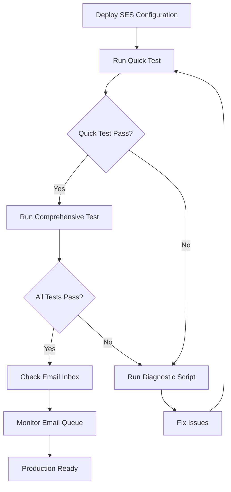
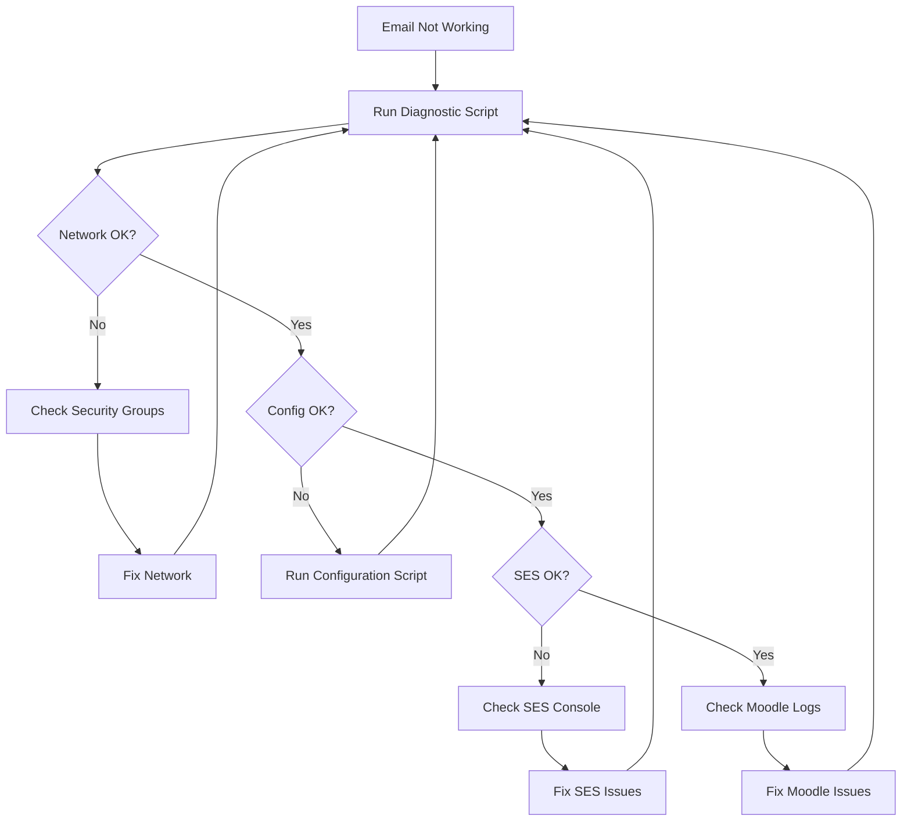

# Email Testing Summary

## 📧 Testing Capabilities Overview

Comprehensive email testing suite for AWS SES integration with Moodle.

---

## 🎯 Testing Scripts Available

### 1. **Quick Email Test** ⚡
**File:** `scripts/quick-email-test.sh`  
**Duration:** ~30 seconds  
**Purpose:** Fast verification after deployment

**What it tests:**
- ✅ Network connectivity to SES (port 587)
- ✅ Moodle configuration exists
- ✅ Database connectivity
- ✅ SMTP configuration in Moodle
- ✅ Send test email
- ✅ Process email queue
- ✅ Verify email delivery

**Usage:**
```bash
# On instance
sudo bash /tmp/quick-email-test.sh
```

**When to use:**
- After initial deployment
- Quick health check
- Verify basic functionality

---

### 2. **Comprehensive Email Delivery Test** 🔍
**File:** `scripts/test-ses-email-delivery.sh`  
**Duration:** ~2-3 minutes  
**Purpose:** Full diagnostic and testing

**What it tests (8 phases):**

**Phase 1: Network Connectivity**
- DNS resolution
- Port 587 (STARTTLS)
- Port 465 (TLS)
- Port 443 (HTTPS)

**Phase 2: Configuration Verification**
- Moodle config.php
- SMTP host configured
- SMTP security (TLS)
- SMTP port (587)
- SMTP credentials

**Phase 3: SES Service Verification**
- SES API access
- Sending quota
- Sandbox vs Production
- Verified identities

**Phase 4: SMTP Authentication**
- Credentials in Secrets Manager
- SMTP connection test
- STARTTLS negotiation

**Phase 5: Email Queue**
- Queue table exists
- Queue statistics

**Phase 6: Send Test Email**
- Create test email
- Queue for delivery

**Phase 7: Process Queue**
- Run Moodle cron
- Send emails via SES

**Phase 8: Verify Delivery**
- Check email status
- Display statistics

**Usage:**
```bash
# On instance
sudo bash /tmp/test-ses-email-delivery.sh
```

**When to use:**
- After deployment
- Troubleshooting issues
- Comprehensive verification
- Before production launch

---

### 3. **Remote Email Test** 🌐
**File:** `scripts/test-ses-email-remote.ps1`  
**Duration:** ~3-5 minutes  
**Purpose:** Test from local machine via SSM

**What it does:**
- ✅ Auto-detects running instances
- ✅ Uploads test script to S3
- ✅ Runs comprehensive tests via SSM
- ✅ Collects and displays results
- ✅ Checks SES statistics
- ✅ Provides summary report

**Usage:**
```powershell
# Test all instances
.\scripts\test-ses-email-remote.ps1

# Test specific instance
.\scripts\test-ses-email-remote.ps1 -InstanceId i-1234567890abcdef0

# Test without sending email
.\scripts\test-ses-email-remote.ps1 -SendTestEmail:$false
```

**When to use:**
- Testing from local machine
- Testing multiple instances
- Automated testing
- CI/CD pipelines

---

### 4. **Diagnostic Script** 🔧
**File:** `scripts/diagnose-ses-email.sh`  
**Duration:** ~1-2 minutes  
**Purpose:** Troubleshoot email issues

**What it checks:**
- Environment information
- Network connectivity
- Security group rules
- VPC endpoint status
- NAT Gateway configuration
- Moodle configuration
- IAM permissions
- Provides recommendations

**Usage:**
```bash
# On instance
sudo bash /tmp/diagnose-ses-email.sh
```

**When to use:**
- Email delivery failing
- Troubleshooting issues
- Verifying configuration
- Before contacting support

---

## 📊 Test Results Interpretation

### ✅ All Tests Passing

```
=== TEST SUMMARY ===

Total Tests: 15
Passed: 15
Failed: 0

🎉 ALL TESTS PASSED!
```

**Meaning:** SES email delivery is fully functional

**Next steps:**
1. Check email inbox for test email
2. Monitor email queue
3. Set up CloudWatch alarms
4. Request production access (if needed)

---

### ⚠️ Partial Failures

#### Network Issues
```
✗ FAILED: Port 587 (STARTTLS) Connectivity
```

**Cause:** Security group or VPC endpoint issue  
**Fix:** Check egress rules, verify VPC endpoint

#### Configuration Issues
```
✗ FAILED: SMTP User configured
✗ FAILED: SMTP Password configured
```

**Cause:** Moodle not configured  
**Fix:** Run `configure-moodle-ses-email.sh`

#### SES Issues
```
⚠ SES is in SANDBOX mode
```

**Cause:** SES account restrictions  
**Fix:** Verify email addresses or request production access

---

## 🚀 Testing Workflow

### After Initial Deployment



### Troubleshooting Workflow



---

## 📋 Testing Checklist

### Pre-Deployment Testing
- [ ] CDK stack synthesized successfully
- [ ] SES resources verified in template
- [ ] Email addresses verified in SES
- [ ] SMTP credentials created
- [ ] Credentials stored in Secrets Manager

### Post-Deployment Testing
- [ ] Quick test passed
- [ ] Comprehensive test passed
- [ ] Test email received in inbox
- [ ] Email queue processing correctly
- [ ] No failed emails in queue
- [ ] SES statistics show successful sends

### Production Readiness
- [ ] All tests passing on all instances
- [ ] CloudWatch alarms configured
- [ ] Email bounce handling configured
- [ ] Production access granted (if needed)
- [ ] Monitoring dashboard created
- [ ] Documentation updated

---

## 🔍 Manual Testing Commands

### Quick Checks

```bash
# Test SMTP connectivity
timeout 10 bash -c 'cat < /dev/null > /dev/tcp/email-smtp.ca-central-1.amazonaws.com/587'

# Check Moodle SMTP config
mariadb -h DB_HOST -u USER -p -D DB_NAME -e \
  "SELECT name, value FROM mdl_config WHERE name LIKE 'smtp%'"

# View email queue
mariadb -h DB_HOST -u USER -p -D DB_NAME -e \
  "SELECT * FROM mdl_email_queue ORDER BY timecreated DESC LIMIT 10"

# Process email queue
cd /app/moodle
sudo -u apache php admin/cli/adhoc_task.php --execute=\\core\\task\\send_email_task
```

### SES Checks

```bash
# Check SES quota
aws ses get-send-quota --region ca-central-1

# List verified emails
aws ses list-verified-email-addresses --region ca-central-1

# Get send statistics
aws ses get-send-statistics --region ca-central-1
```

---

## 📈 Monitoring After Testing

### CloudWatch Metrics to Monitor

```bash
# SES sends
aws cloudwatch get-metric-statistics \
  --namespace AWS/SES \
  --metric-name Send \
  --dimensions Name=Region,Value=ca-central-1 \
  --start-time $(date -u -d '1 hour ago' +%Y-%m-%dT%H:%M:%S) \
  --end-time $(date -u +%Y-%m-%dT%H:%M:%S) \
  --period 300 \
  --statistics Sum

# SES bounces
aws cloudwatch get-metric-statistics \
  --namespace AWS/SES \
  --metric-name Bounce \
  --dimensions Name=Region,Value=ca-central-1 \
  --start-time $(date -u -d '1 hour ago' +%Y-%m-%dT%H:%M:%S) \
  --end-time $(date -u +%Y-%m-%dT%H:%M:%S) \
  --period 300 \
  --statistics Sum
```

### Moodle Email Queue Monitoring

```sql
-- Real-time queue status
SELECT 
  COUNT(*) as total,
  SUM(CASE WHEN status = 0 THEN 1 ELSE 0 END) as pending,
  SUM(CASE WHEN status = 1 THEN 1 ELSE 0 END) as sent,
  SUM(CASE WHEN status = 2 THEN 1 ELSE 0 END) as failed
FROM mdl_email_queue;

-- Failed emails in last 24 hours
SELECT id, recipient, subject, FROM_UNIXTIME(timecreated) as created
FROM mdl_email_queue 
WHERE status = 2 
  AND timecreated > UNIX_TIMESTAMP(NOW() - INTERVAL 24 HOUR)
ORDER BY timecreated DESC;
```

---

## 🆘 Getting Help

### If Tests Fail

1. **Run diagnostic script:**
   ```bash
   sudo bash /tmp/diagnose-ses-email.sh > /tmp/diagnostic-output.txt
   ```

2. **Collect logs:**
   ```bash
   tail -100 /var/log/httpd/error_log > /tmp/moodle-errors.txt
   ```

3. **Check email queue:**
   ```sql
   SELECT * FROM mdl_email_queue WHERE status = 2 ORDER BY timecreated DESC LIMIT 10;
   ```

4. **Review documentation:**
   - `docs/EMAIL-TESTING-GUIDE.md` - Full testing guide
   - `docs/SES-EMAIL-CONFIGURATION.md` - Configuration guide
   - `docs/SES-QUICK-START.md` - Quick start guide

---

## 📚 Related Documentation

- **Testing Guide:** `docs/EMAIL-TESTING-GUIDE.md`
- **Configuration Guide:** `docs/SES-EMAIL-CONFIGURATION.md`
- **Quick Start:** `docs/SES-QUICK-START.md`
- **Implementation Summary:** `docs/SES-IMPLEMENTATION-SUMMARY.md`

---

## ✅ Success Criteria

Email testing is successful when:

- ✅ All network connectivity tests pass
- ✅ Moodle configuration verified
- ✅ SMTP authentication successful
- ✅ Test email sent and received
- ✅ Email queue processing correctly
- ✅ No failed emails in queue
- ✅ SES statistics show successful sends
- ✅ CloudWatch metrics showing activity

---

**Last Updated:** 2025-01-29  
**Region:** ca-central-1  
**Moodle Version:** 5.0

